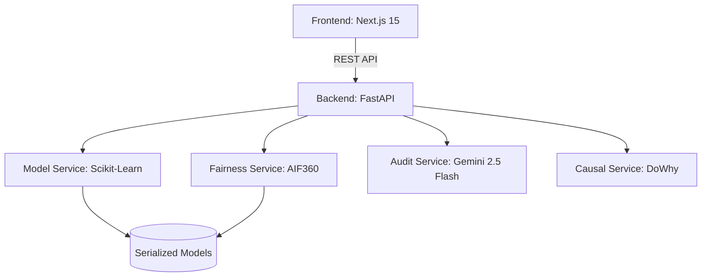
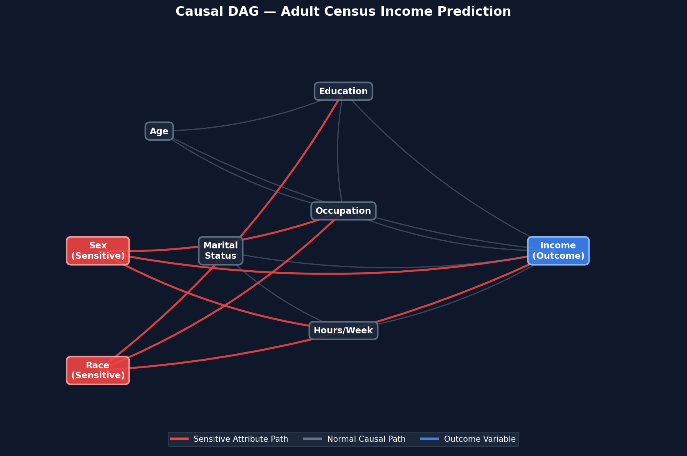

# Sentinel AI Governance Platform


Sentinel is a platform designed to detect, mitigate, and audit bias in machine learning models. It demonstrates how discriminatory patterns in historical data, such as the Adult Census dataset, can be neutralised using fairness interventions.

## Capabilities

| Feature | Technical Implementation | Purpose |
| :--- | :--- | :--- |
| Prediction Gateway | Scikit-Learn Inference Pipeline | Real-time income prediction for applicants. |
| Governance Engine | AIF360 Reweighing Algorithm | Toggle between biased and fair models. |
| Compliance Guardrails | Multi-Regulatory Policy Engine | Frameworks for EU AI Act, GDPR, and US Fair Lending. |
| Fairness Analytics | DIR and DPD Real-time Tracking | Visualisation of the 80% Regulatory Floor. |
| Audit Logic | Google Gemini 2.5 Flash | Natural language explanations of model decisions. |
| Explainability Engine | Logistic Regression Weights | Feature importance comparison. |
| Robustness Probing | Adversarial Stress Testing | Attribute flipping to detect hidden bias. |
| Machine Unlearning | Demographic Pattern Erasure | Simulated cohort data removal for privacy. |
| Causal Discovery | DoWhy Causal Graphs | Analysis of causal influence vs correlation. |

## System Architecture

Sentinel uses a modular architecture to separate governance logic from the core inference engine.



## Causal Discovery

The platform utilizes causal inference to distinguish between causal pathways and spurious correlations in the training data.



## Quick Start Guide

### 1. Backend Initialization
Run these commands in your terminal to set up the Python environment and train the models.

```bash
# Clone the repository
cd backend

# Environment Setup
python -m venv venv
source venv/bin/activate  # Windows: venv\Scripts\activate
pip install -r requirements.txt

# Model & Asset Generation
python train.py
python generate_causal_dag.py

# Configuration
echo "GEMINI_API_KEY=your_actual_key_here" > .env

# Execution
uvicorn app.main:app --reload --port 8000
```

### 2. Frontend Initialization
Run these commands in a new terminal window to start the dashboard.

```bash
# Navigate to frontend
cd frontend

# Dependency Installation
npm install

# Start Development Server
npm run dev
```

## Fairness Mitigation

A standard Logistic Regression model trained on Adult Census data typically shows a Disparate Impact Ratio (DIR) of 0.35 for gender, indicating significant bias. Sentinel applies AIF360 Reweighing during pre-processing to assign weights to training samples, balancing the representation of underprivileged groups. This intervention improves the DIR to approximately 0.95 without significant loss in accuracy.

## API Endpoints

| Method | Endpoint | Description |
| :--- | :--- | :--- |
| POST | /api/predict | Binary Prediction and Probability. |
| POST | /api/fairness | DIR, DPD, and Accuracy metrics. |
| POST | /api/audit | Gemini-generated audit receipts. |
| GET | /api/explain | Feature importance weights. |
| POST | /api/stress | Adversarial robustness scores. |
| POST | /api/unlearn | Simulated demographic unlearning. |
| GET | /api/causal/dag | URL for pre-computed causal graph. |

## Deployment Status
- [x] Vercel (Frontend)
- [x] Local Environment (Full Stack)
- [ ] Google Cloud Platform (Enterprise Deployment)

## License
Licensed under the Apache License, Version 2.0.
